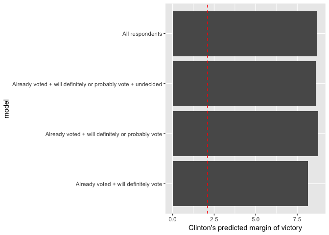
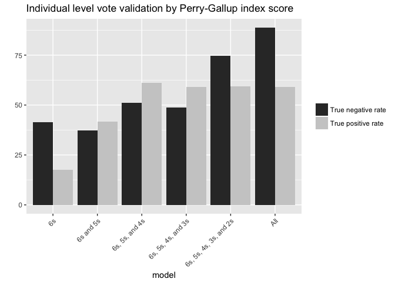
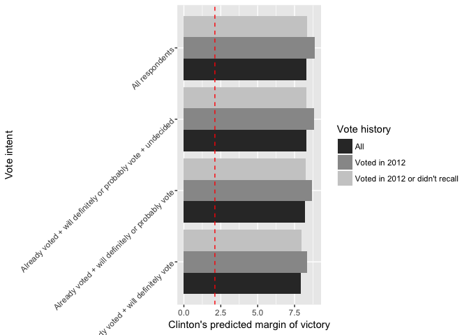
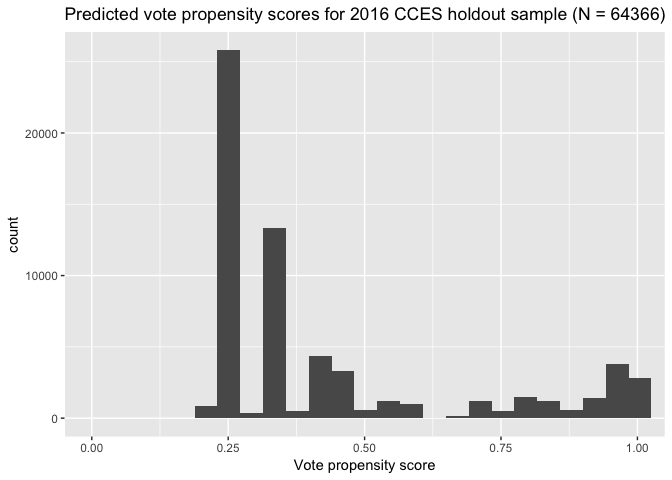

Analysis Part I - Cutoff Models
================
February 5, 2018

-   [Introduction](#introduction)
-   [Vote Intent](#vote-intent)
    -   [Individual-level turnout](#individual-level-turnout)
    -   [Election predictions](#election-predictions)
-   [Vote Intent + Vote History](#vote-intent-vote-history)
    -   [Individual-level turnout](#individual-level-turnout-1)
    -   [Election predictions](#election-predictions-1)
-   [Perry-Gallup index](#perry-gallup-index)
    -   [Individual-level turnout](#individual-level-turnout-2)
    -   [Election predictions](#election-predictions-2)
-   [Logistic Regression](#logistic-regression)

Introduction
============

In this document, I will define and create the cutoff models that I will use for my analysis and then evaluate their performance. The sections will proceed as follows:

-   Vote intent
-   Vote intent + vote history
-   Perry-Gallup index
-   Logistic regression
    -   Perry-Gallup
    -   Perry-Gallup + all variables potentially related to turnout
    -   Perry-Gallup + all variables potentially related to turnout + structural election variables
-   Random forests
    -   Perry-Gallup
    -   Perry-Gallup + all variables potentially related to turnout
    -   Perry-Gallup + all variables potentially related to turnout + structural election variables

In each section I will create a model and then evaluate how well it predicts voting behavior on an individual-level. At the end, I will use these models to make election predictions.

Vote Intent
===========

For now, I am doing this for 2016 until I can create the pooled data set. Here I treat people who report that they have already voted the same as people who report that they definitely plan to vote. Note that the weight I use -- `commonweight` from the `cces16` data -- combines weights based on age, gender, education, race, voter registration, ideology, baseline party identification, born again status, and political interest.

``` r
# grab data and filter only those with valid vote intent responses
data <- cces16 %>% select(V101, state_abbreviation, CC16_364, CC16_364b, CC16_364c,  
                          CL_E2016GVM, commonweight) %>% 
  rename(ID = V101, state = state_abbreviation, intent = CC16_364, earlychoice = CC16_364b, 
         choice = CC16_364c, validated = CL_E2016GVM, weight = commonweight) %>% 
  filter(intent %in% c(1,2,3,4,5))

# merge vote choice for early/absentee voters and prospective voters
data <- data %>% 
  mutate(choice = replace(choice, earlychoice == 1, 1)) %>% 
  mutate(choice = replace(choice, earlychoice == 2, 2))
```

Individual-level turnout
------------------------

``` r
validation_by_intent <- function(intention){
  willvote <- data %>% 
    filter(intent %in% intention)
  wontvote <- data %>% 
    anti_join(willvote, by = "ID")

  pred_voters <- willvote %>% 
    count(validated = !is.na(validated)) %>% 
    mutate(percent = round((n/sum(n))*100,2)) %>% 
    mutate(validated = replace(validated, validated == "FALSE", "No")) %>% 
    mutate(validated = replace(validated, validated == "TRUE", "Yes")) %>% 
    select(-n)
  
  pred_nonvoters <- wontvote %>% 
    count(validated = !is.na(validated)) %>% 
    mutate(percent = round((n/sum(n))*100,2)) %>% 
    mutate(validated = replace(validated, validated == "FALSE", "No")) %>% 
    mutate(validated = replace(validated, validated == "TRUE", "Yes")) %>% 
    select(-n)
  
  left_join(pred_voters, pred_nonvoters, by = "validated", suffix = c("_v","_nv")) %>% 
    rename(voters = percent_v, nonvoters = percent_nv)
}
```

First we compare individual-level turnout prediction accuracy when we define likely voters as:

-   those who say they already voted
-   those who say they will definitely vote or have voted already
-   those who say they will definitely vote, have voted already, or will probably vote
-   those who say they will definitely vote, have voted already, will probably vote, or who are undecided
-   all respondents in the sample

Let's sum that all up, where

-   true positive rate = rate at which predicted voters are validated as voters
-   true negative rate = rate at which predicted nonvoters are not validated as voters


Election predictions
--------------------

``` r
vote_choice_intent <- function(intention){
  data %>% 
  filter(intent %in% intention) %>% 
  filter(choice %in% c(1,2) | earlychoice %in% c(1,2)) %>% 
  mutate(choice = replace(choice, choice == 1, "Trump")) %>% 
  mutate(choice = replace(choice, choice == 2, "Clinton")) %>% 
  group_by(choice) %>% 
  summarise(n = sum(weight)) %>% 
  mutate(vote_share = round(n/sum(n)*100,2)) %>% 
  select(-n)
}
```

Now we compare election predictions, using the same likely voter models as specified above.



Vote Intent + Vote History
==========================

Let's move on to the next baseline model - using vote history and vote intent. I follow the same template from above but consider what happens when likely voters are defined as individuals who report that they voted in the previous presidential election (2012) as well as what happens when we do not make that distinction.

Individual-level turnout
------------------------

First, I'll consider everyone who self-reported that they voted in 2012. Note that this will necessarily exclude any respondent who was too young to vote in 2012 (unless they lie on this question, of course).

| Vote history                                | Vote intent                                                  |  True positive rate|  True negative rate|
|:--------------------------------------------|:-------------------------------------------------------------|-------------------:|-------------------:|
| Voted in 2012                               | Already voted + will definitely vote                         |               64.61|               63.08|
|                                             | Already voted + will definitely or probably vote             |               63.46|               64.80|
|                                             | Already voted + will definitely or probably vote + undecided |               62.98|               62.10|
|                                             | All respondents                                              |               62.58|               50.43|
| Voted in 2012 or don't recall               | Already voted + will definitely vote                         |               64.47|               65.88|
|                                             | Already voted + will definitely or probably vote             |               63.31|               73.60|
|                                             | Already voted + will definitely or probably vote + undecided |               62.80|               80.00|
|                                             | All respondents                                              |               62.37|               46.75|
| Voted in 2012, don't recall, or didn't vote | Already voted + will definitely vote                         |               64.47|               66.38|
|                                             | Already voted + will definitely or probably vote             |               63.31|               75.53|
|                                             | Already voted + will definitely or probably vote + undecided |               62.79|               86.21|
|                                             | All respondents                                              |               62.36|                  NA|

Election predictions
--------------------



My takeaway is that adding vote history does not add much information on top of vote intent. But this is just for 2016 election predictions - may be useful to predict individual-level turnout and may be useful for other elections still.

Perry-Gallup index
==================

In their 2016 report on likely voter methodology, the Pew Research Center uses the Perry-Gallup index to measure likelyhood to vote. The questions they use, as well as the response options, are listed below. Response options that are bolded give a respondent a point in the index.

-   How much thought have you given to the coming November election? **Quite a lot**, **some**, only a little, none.
-   Have you ever voted in your precinct or election district? **Yes**, no.
-   Would you say you follow what’s going on in government and public affairs **most of the time**, **some of the time**, only now and then, hardly at all?
-   How often would you say you vote? **Always**, **nearly always**, part of the time, seldom.
-   How likely are you to vote in the general election this November? **Definitely will vote**, **probably will vote**, probably will not vote, definitely will not vote.
-   In the 2012 presidential election between Barack Obama and Mitt Romney, did things come up that kept you from voting, or did you happen to vote? **Yes, voted**; no.
-   Please rate your chance of voting in November on a scale of 10 to 1. 0-8, **9**, **10**.

Since the common content of the CCES does not include all of these survey items (and question wording varies when they do appear), I will attempt to recreate the index using what is available to me.

The three variables I will consider are vote intent, vote history, and political interest, which capture 5 of the 7 items on the Perry-Gallup index. The one dimension that I will not be able to recreate is historical voting behavior (voted in precinct before, voting frequency), as this information is not available on the CCES. Here are the CCES questions I will use along with the response options, and how many points each response option gives an individual toward the index.

-   Do you intend to vote in 2016 general election?
    -   Yes, definitely (**+2**)
    -   Probably (**+1**)
    -   I already voted (early or absentee) (**+2**)
    -   No
    -   Undecided
-   In 2012, who did you vote for in the election for President?
    -   Barack Obama (**+1**)
    -   Mitt Romney (**+1**)
    -   Someone else (**+1**)
    -   Did not vote
    -   Don't recall
-   Some people seem to follow what is going on in government or public affairs most of the time, whether there's an election or not. Others aren't that interested. Would you say you follow what is going on in government and public affairs...
    -   Most of the time (**+2**)
    -   Some of the time (**+1**)
    -   Only now and then
    -   Hardly at all
    -   Don't know

There are two further adjustments I make. First, Pew samples off of a list of registered voters, which the CCES does not do. To compensate, respondents who report that they are registered to vote are given an additional point. Second, since respondents who are younger than 22 would not have had the chance to vote in the previous election, they are given one additional point.

The minimum score, corresponding to those least likely to vote, is 0 while the maximum score, corresponding to those most likely to vote, is 6.

``` r
data <- cces16 %>% select(V101, state_abbreviation, CC16_364b, CC16_364c,  
                          CL_E2016GVM, commonweight, CC16_326, CC16_364, newsint, birthyr, votereg) %>% 
  rename(ID = V101, state = state_abbreviation, earlychoice = CC16_364b, choice = CC16_364c, 
         validated = CL_E2016GVM, weight = commonweight, vote12 = CC16_326, intent = CC16_364, 
         interest = newsint, birthyr = birthyr, registration = votereg) %>% 
  mutate(age = 2016 - birthyr) %>% 
  select(-birthyr)

# merge vote choice for early/absentee voters and prospective voters
data <- data %>% 
  mutate(choice = replace(choice, earlychoice == 1, 1)) %>% 
  mutate(choice = replace(choice, earlychoice == 2, 2))

# calculate Perry-Gallup index
data <- data %>% mutate(perry_gallup = 0)

# vote intent
data$perry_gallup[data$intent == 1 | data$intent == 3] <- data$perry_gallup + 2
data$perry_gallup[data$intent == 2]  <- data$perry_gallup + 1

# vote history
data$perry_gallup[data$vote12 == 1 | data$vote12 == 2 | data$vote12 == 3] <- data$perry_gallup + 1

# political interest
data$perry_gallup[!is.na(data$interest) && data$interest == 1] <- data$perry_gallup + 2
data$perry_gallup[!is.na(data$interest) && data$interest == 2] <- data$perry_gallup + 1

# voter registration 
data$perry_gallup[data$registration == 1] <- data$perry_gallup + 1

# age adjustment
data$perry_gallup[data$age < 22 && (data$vote12 == 4 | data$vote12 == 5 | 
                                      data$vote12 == 8 | data$vote12 == 9)] <- data$perry_gallup + 1
```

Individual-level turnout
------------------------



Election predictions
--------------------



Logistic Regression
===================

For the Perry-Gallup regression and RF sections I should make an age and RV adjustment. For age, make two categories: eligible to vote in previous election or not (i.e., age over or under 22). And then a similar one for RVs versus non-RVs.
