Analysis Part I - National Models
================
May 8, 2018

-   [Introduction](#introduction)
-   [Vote Intent](#vote-intent)
    -   [Individual-level turnout](#individual-level-turnout)
    -   [Election predictions](#election-predictions)
-   [Vote Intent + Vote History](#vote-intent-vote-history)
    -   [Individual-level turnout](#individual-level-turnout-1)
    -   [Election predictions](#election-predictions-1)
-   [Perry-Gallup index](#perry-gallup-index)
    -   [Individual-level turnout](#individual-level-turnout-2)
    -   [Election predictions](#election-predictions-2)
-   [Logistic Regression](#logistic-regression)
    -   [Perry-Gallup index](#perry-gallup-index-1)
    -   [Perry-Gallup index + all variables potentially related to turnout](#perry-gallup-index-all-variables-potentially-related-to-turnout)
    -   [Perry-Gallup index + all variables potentially related to turnout + structural election variables](#perry-gallup-index-all-variables-potentially-related-to-turnout-structural-election-variables)
-   [Random Forests](#random-forests)
    -   [Perry-Gallup index](#perry-gallup-index-2)
    -   [Perry-Gallup index + all variables potentially related to turnout](#perry-gallup-index-all-variables-potentially-related-to-turnout-1)
    -   [Perry-Gallup index + all variables potentially related to turnout + structural election variables](#perry-gallup-index-all-variables-potentially-related-to-turnout-structural-election-variables-1)

Introduction
============

In this document, I will define and create the cutoff models that I will use for my analysis and then evaluate their performance. The sections will proceed as follows:

-   Vote intent
-   Vote intent + vote history
-   Perry-Gallup index
-   Logistic regression
    -   Perry-Gallup
    -   Perry-Gallup + all variables potentially related to turnout
    -   Perry-Gallup + all variables potentially related to turnout + structural election variables
-   Random forests
    -   Perry-Gallup
    -   Perry-Gallup + all variables potentially related to turnout
    -   Perry-Gallup + all variables potentially related to turnout + structural election variables

In each section I will create a model and then evaluate how well it predicts voting behavior on an individual-level. At the end, I will use these models to make election predictions.

Vote Intent
===========

For this section (and the next two), I only need to use 2016 data until. I treat people who report that they have already voted the same as people who report that they definitely plan to vote. Note that the weight I use -- which comes from the cumulative CCES file -- combines weights based on age, gender, education, race, voter registration, ideology, baseline party identification, born again status, and political interest.

Individual-level turnout
------------------------

First we compare individual-level turnout prediction accuracy when we define likely voters as:

-   those who say they will definitely vote or have voted already
-   those who say they will definitely vote, have voted already, or will probably vote
-   those who say they will definitely vote, have voted already, will probably vote, or who are undecided
-   all respondents in the sample

where:

-   true positive rate = rate at which predicted voters are validated as voters
-   true negative rate = rate at which predicted nonvoters are not validated as voters

Election predictions
--------------------

Now we compare election predictions, using the same likely voter models as specified above.

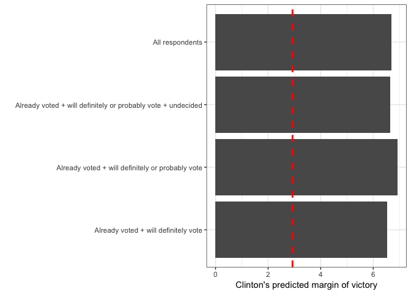

Vote Intent + Vote History
==========================

Let's move on to the next baseline model - using vote history and vote intent. I follow the same template from above but consider what happens when likely voters are defined as individuals who report that they voted in the previous presidential election (2012) as well as what happens when we do not make that distinction.

Note that this will necessarily exclude any respondent who was too young to vote in 2012 (unless they lie on this question, of course).

Individual-level turnout
------------------------

First, I'll consider everyone who self-reported that they voted in 2012. Then I'll consider everyone who self-reported that they voted in 2012 and those that reported that they did not vote or that they do not remember.

| Vote history                                | Vote intent                                                  |  True positive rate|  True negative rate|
|:--------------------------------------------|:-------------------------------------------------------------|-------------------:|-------------------:|
| Voted in 2012                               | Already voted + will definitely vote                         |               62.92|               78.50|
|                                             | Already voted + will definitely or probably vote             |               60.54|               80.20|
|                                             | Already voted + will definitely or probably vote + undecided |               59.15|               79.85|
|                                             | All respondents                                              |               57.34|               77.76|
| Voted in 2012, don't recall, or didn't vote | Already voted + will definitely vote                         |               61.55|               85.57|
|                                             | Already voted + will definitely or probably vote             |               57.99|               92.09|
|                                             | Already voted + will definitely or probably vote + undecided |               55.32|               95.33|
|                                             | All respondents                                              |               50.85|                  NA|

Election predictions
--------------------

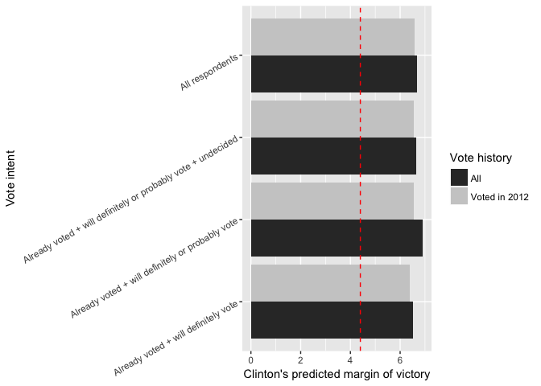

My takeaway is that adding vote history does not add much information on top of vote intent. But this is just for 2016 election predictions - may be useful to predict individual-level turnout and may be useful for other elections still.

Perry-Gallup index
==================

In their 2016 report on likely voter methodology, the Pew Research Center uses the Perry-Gallup index to measure likelyhood to vote. The questions they use, as well as the response options, are listed below. Response options that are bolded give a respondent a point in the index.

-   How much thought have you given to the coming November election? **Quite a lot**, **some**, only a little, none.
-   Have you ever voted in your precinct or election district? **Yes**, no.
-   Would you say you follow what’s going on in government and public affairs **most of the time**, **some of the time**, only now and then, hardly at all?
-   How often would you say you vote? **Always**, **nearly always**, part of the time, seldom.
-   How likely are you to vote in the general election this November? **Definitely will vote**, **probably will vote**, probably will not vote, definitely will not vote.
-   In the 2012 presidential election between Barack Obama and Mitt Romney, did things come up that kept you from voting, or did you happen to vote? **Yes, voted**; no.
-   Please rate your chance of voting in November on a scale of 10 to 1. 0-8, **9**, **10**.

Since the common content of the 2016 CCES does not include all of these survey items (and question wording varies when they do appear), I will attempt to recreate the index using what is available to me.

The three variables I will consider are vote intent, vote history, and political interest, which capture 5 of the 7 items on the Perry-Gallup index. The one dimension that I will not be able to recreate is self-reported historical voting behavior (voted in precinct before, voting frequency), as this information is not available on the CCES. Here are the CCES questions I will use along with the response options, and how many points each response option gives an individual toward the index.

-   Do you intend to vote in 2016 general election?
    -   Yes, definitely (**+2**)
    -   Probably (**+1**)
    -   I already voted (early or absentee) (**+2**)
    -   No
    -   Undecided
-   Did you vote in the 2012 general election?
    -   Yes (**+1**)
    -   No
-   Some people seem to follow what is going on in government or public affairs most of the time, whether there's an election or not. Others aren't that interested. Would you say you follow what is going on in government and public affairs...
    -   Most of the time (**+2**)
    -   Some of the time (**+1**)
    -   Only now and then
    -   Hardly at all
    -   Don't know

There are two further adjustments I make. First, Pew samples off of a list of registered voters, which the CCES does not do. To compensate, respondents who report that they are registered to vote are given an additional point. Second, since respondents who are younger than 22 would not have had the chance to vote in the previous election, they are given one additional point.

The minimum score, corresponding to those least likely to vote, is 0 while the maximum score, corresponding to those most likely to vote, is 6.

Individual-level turnout
------------------------

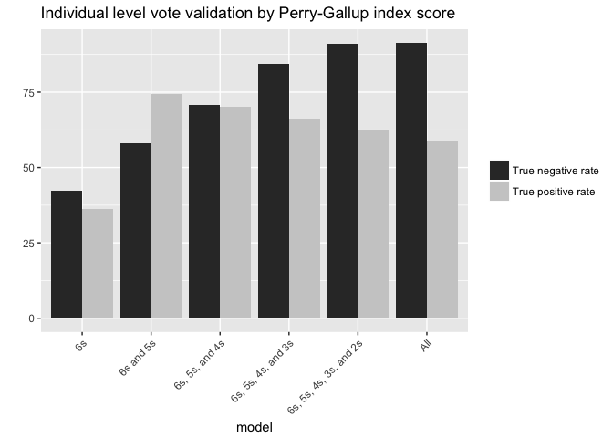

Election predictions
--------------------

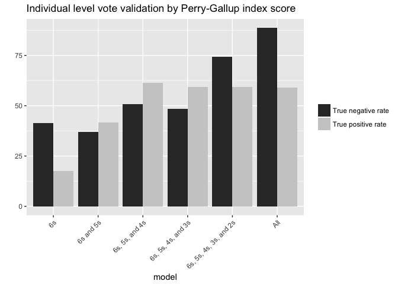

Logistic Regression
===================

For this section I will begin using the cumulative CCES file. I'll consider three sets of variables:

-   Perry-Gallup index
-   Perry-Gallup index + all variables potentially related to turnout
-   Perry-Gallup index + all variables potentially related to turnout + structural election variables

Note that when I just consider the Perry-Gallup index I do make a similar adjustment for age and registration. For age, I define a variable `eligible` that is coded 1 if a respondent was old enough to vote in the previous presidential election and coded 0 if a respondent was not old enough to vote in the previous election. For registration, I recode the variable to be 1 if the respondent reported that they were registered to vote and 0 if they reported that they were not registered or if they did not know.

Perry-Gallup index
------------------

### Individual-level turnout

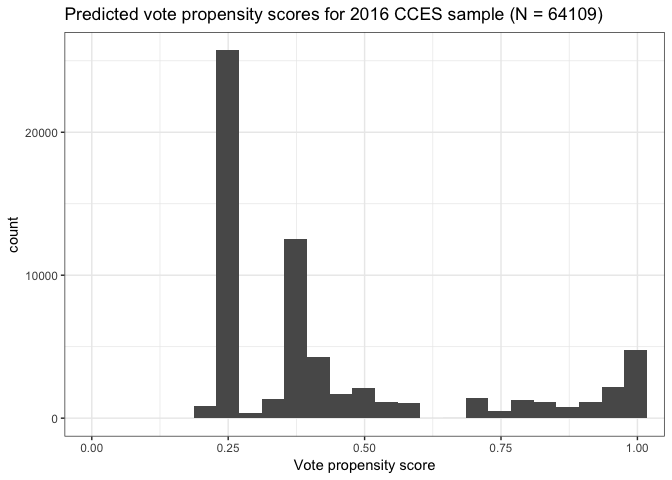

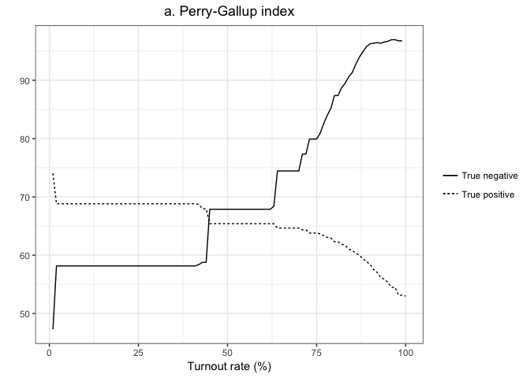

### Election Predictions

Note that I include two calculations here: in one, I consider the margin of victory for Clinton only weighted by the weighting variable included in the pooled CCES while in the other I consider the margin weighted by that weight times the vote propensity score from the model.

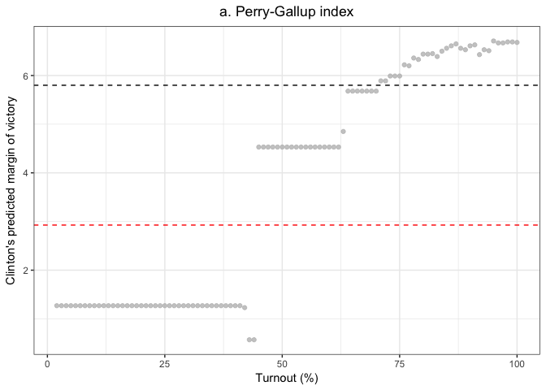

Perry-Gallup index + all variables potentially related to turnout
-----------------------------------------------------------------

This next model considers the Perry-Gallup index variables mentioned in the previous section in addition to a whole slew of demographic variables that literature has suggested may be tied to turnout or to misreporting voting intention. These include:

-   Age
-   Race
-   Education
-   Income
-   Partisan strength
-   Religiosity
-   Marital status
-   Residential mobility
-   ~~Racial composition of district~~
-   ~~Political interest/activism~~
    -   ~~Watching news~~
    -   ~~Reading newspaper~~

The racial composition of district and political interest/activism items are not included in my model because they are not widely available on the CCES surveys I consider.

### Individual-level turnout

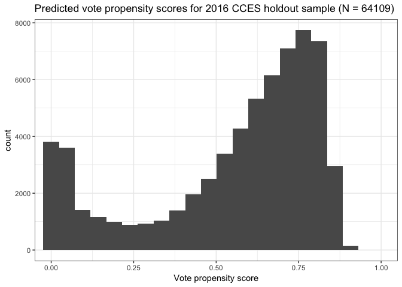

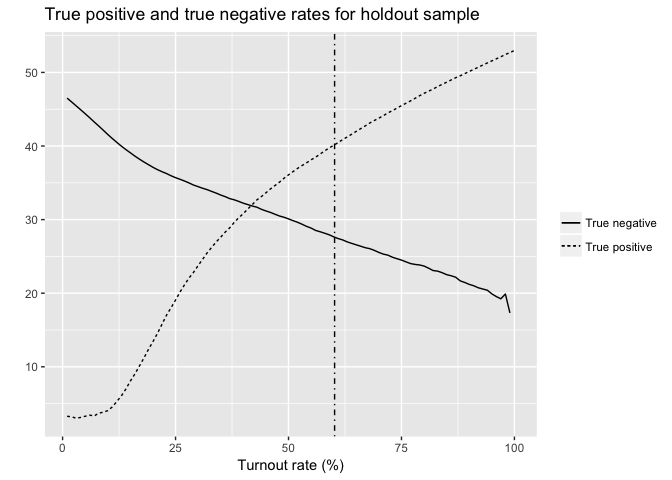

### Election Predictions

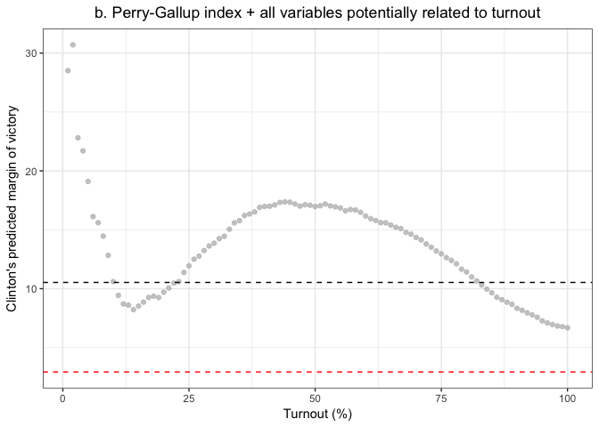

Perry-Gallup index + all variables potentially related to turnout + structural election variables
-------------------------------------------------------------------------------------------------

In addtion to the variables I included in the last mode, I now include structural election variables. I use a reformulation of Abramowitz's Time-for-Change model. The model predicts the vote share for the candidate of the incumbent's party based on

-   the net approval rating of the sitting President (using the final Gallup poll in June of the election year)
-   the annualized growth rate of real GDP in the second quarter of the election year (taken from the U.S. Department of Commerce's Bureau of Economic Analysis)
-   whether a first-term incumbent is running
    -   Since I also use midterm election years, I consider whether the incumbent and the President are from the same party (this is coded 1 in presidential election years and 1 or 0 in midterm years)
-   an indicator variable to measure the level of polarization (this was added in 2012): it is coded
    -   1 if first-term incumbent running or open seat where incumbent president has net approval rating over 0 (presidential election years) or 1 if the House incumbent is from the same party as the President or if they are from different parties and the President has a net approval rating over 0 (midterm election years)
    -   0 if no first-term incumbent or incumbent president has net approval rating less than 0 (presidential election years) or 0 if the House incumbent and President are from different parties and the presidential net approval rating is less than 0 (midterm election years)

You can read more about his model [here](https://www.washingtonpost.com/blogs/ezra-klein/files/2012/08/abramowitz.pdf).

### Individual-level turnout

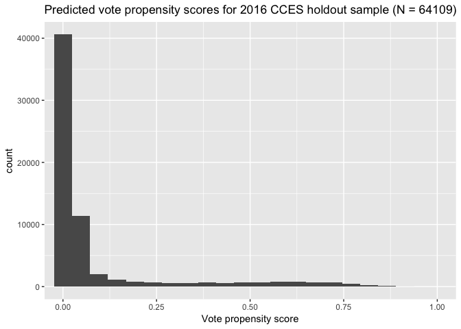

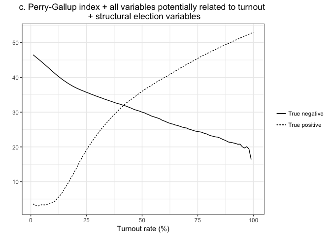

### Election Predictions

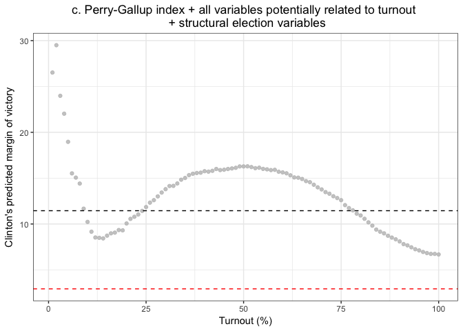

Random Forests
==============

For this section I will proceed as I did in the last section, except now I use random forest models instead of logistic regression models. Again, the layout will be:

-   Perry-Gallup index
-   Perry-Gallup index + all variables potentially related to turnout
-   Perry-Gallup index + all variables potentially related to turnout + structural election variables

Perry-Gallup index
------------------

### Individual-level turnout

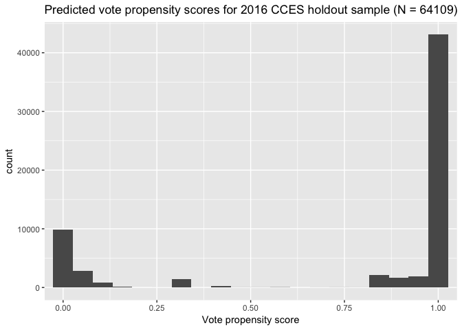

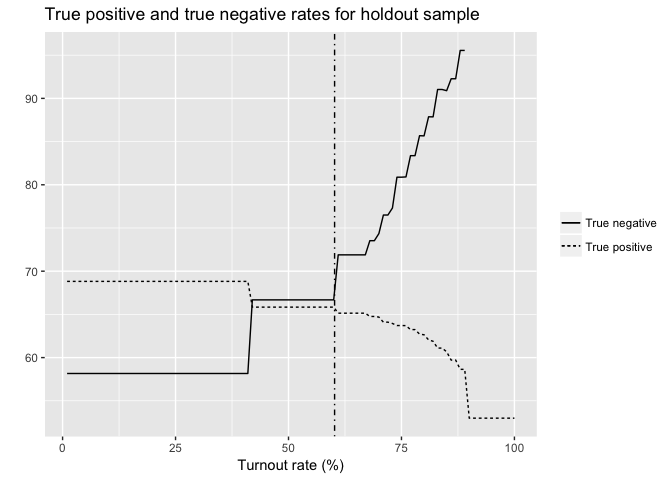

### Election Predictions

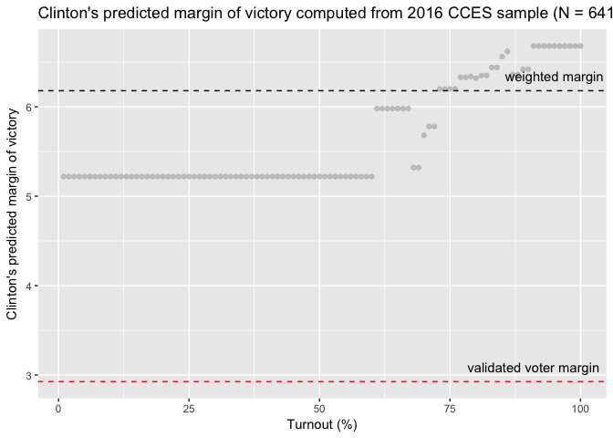

Perry-Gallup index + all variables potentially related to turnout
-----------------------------------------------------------------

This next model considers the Perry-Gallup index variables mentioned in the previous section in addition to a whole slew of demographic variables that literature has suggested may be tied to turnout or to misreporting voting intention. These include:

-   Age
-   Race
-   Education
-   Income
-   Partisan strength
-   Religiosity
-   Marital status
-   Residential mobility
-   ~~Racial composition of district~~
-   ~~Political interest/activism~~
    -   ~~Watching news~~
    -   ~~Reading newspaper~~

The racial composition of district and political interest/activism items are not included in my model because they are not widely available on the CCES surveys I consider.

### Individual-level turnout

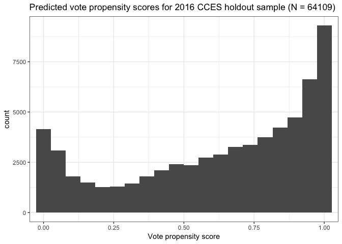

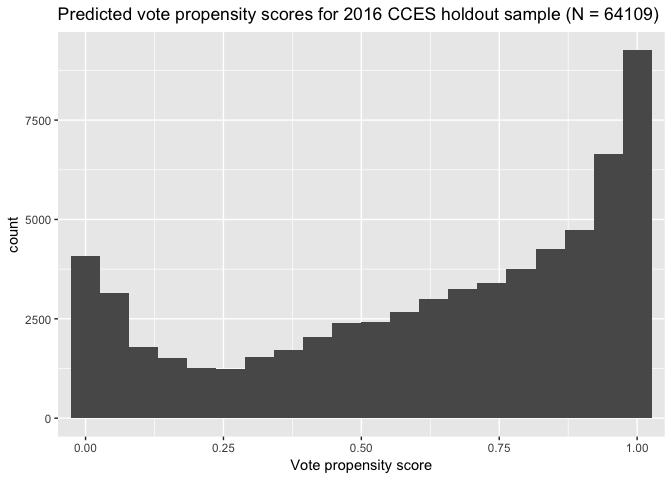

### Election Predictions

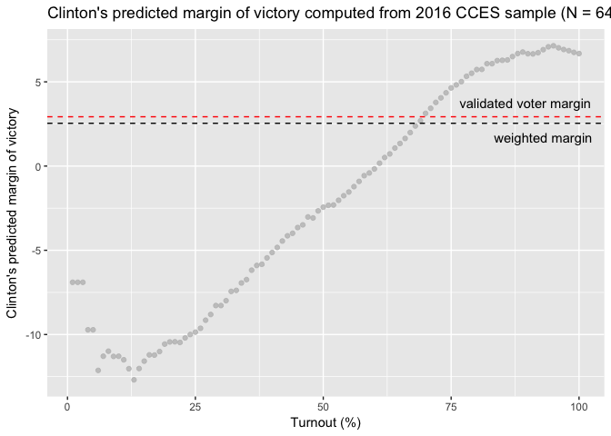

Perry-Gallup index + all variables potentially related to turnout + structural election variables
-------------------------------------------------------------------------------------------------

In addtion to the variables I included in the last mode, I now include structural election variables. I use a reformulation of Abramowitz's Time-for-Change model. The model predicts the vote share for the candidate of the incumbent's party based on

-   the net approval rating of the sitting President (using the final Gallup poll in June of the election year)
-   the annualized growth rate of real GDP in the second quarter of the election year (taken from the U.S. Department of Commerce's Bureau of Economic Analysis)
-   whether a first-term incumbent is running
    -   Since I also use midterm election years, I consider whether the incumbent and the President are from the same party (this is coded 1 in presidential election years and 1 or 0 in midterm years)
-   an indicator variable to measure the level of polarization (this was added in 2012): it is coded
    -   1 if first-term incumbent running or open seat where incumbent president has net approval rating over 0 (presidential election years) or 1 if the House incumbent is from the same party as the President or if they are from different parties and the President has a net approval rating over 0 (midterm election years)
    -   0 if no first-term incumbent or incumbent president has net approval rating less than 0 (presidential election years) or 0 if the House incumbent and President are from different parties and the presidential net approval rating is less than 0 (midterm election years)

You can read more about his model [here](https://www.washingtonpost.com/blogs/ezra-klein/files/2012/08/abramowitz.pdf).

### Individual-level turnout

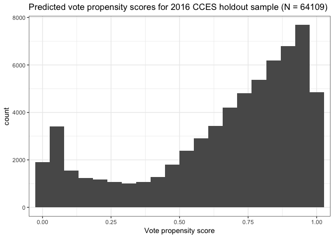

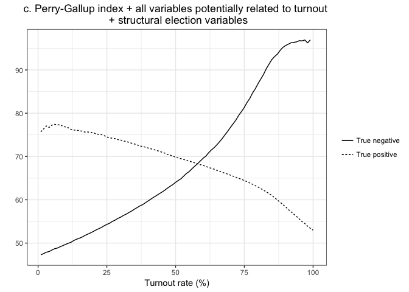

### Election Predictions

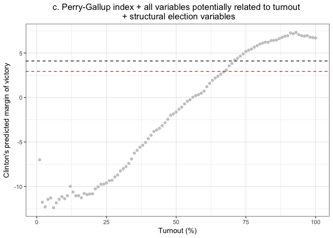
