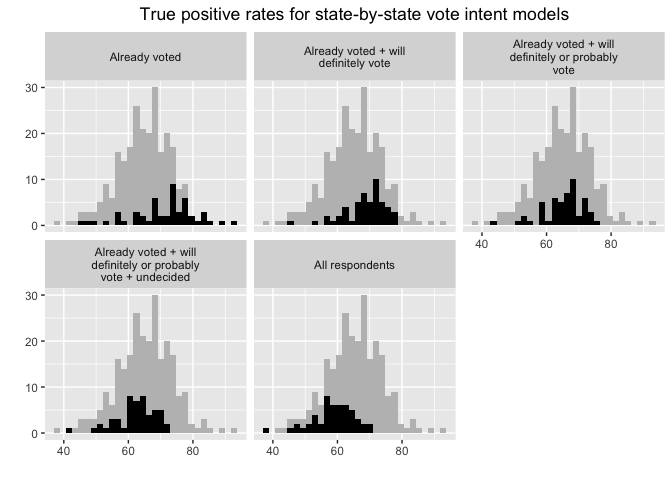
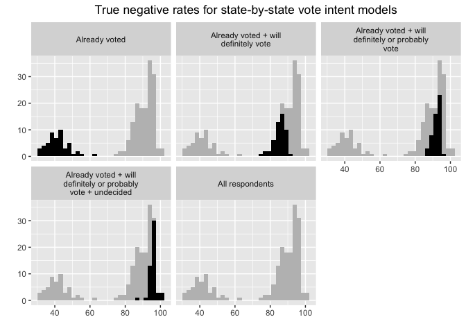
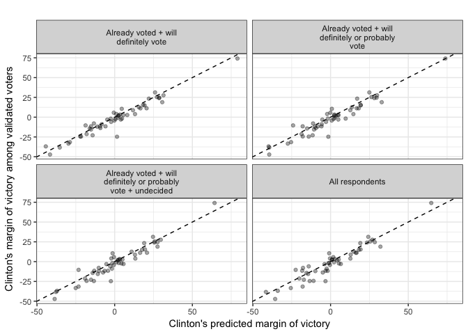
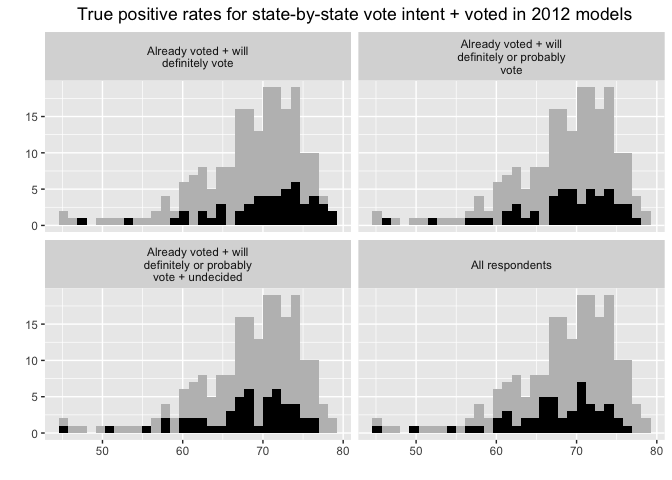
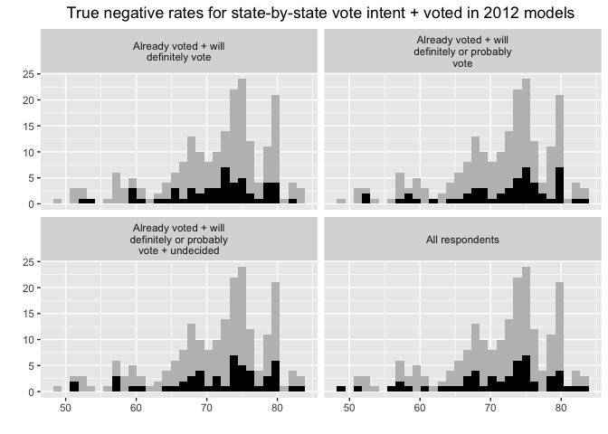
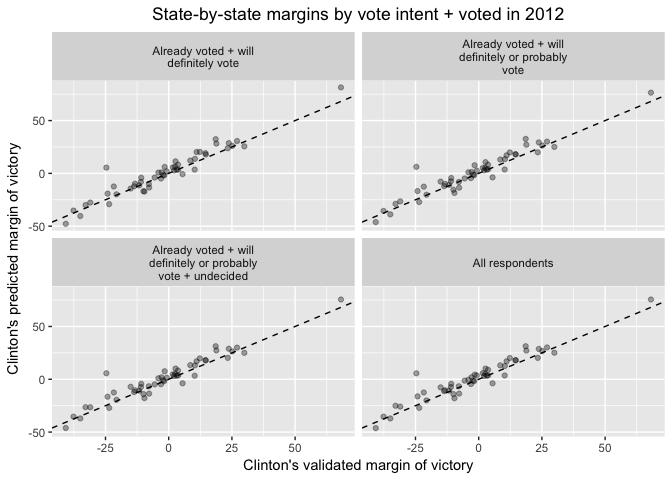
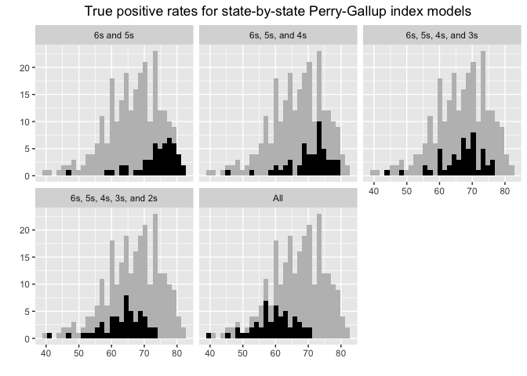
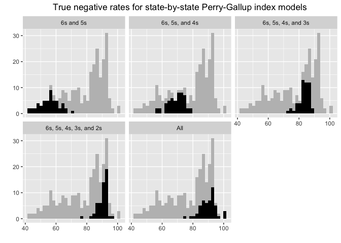
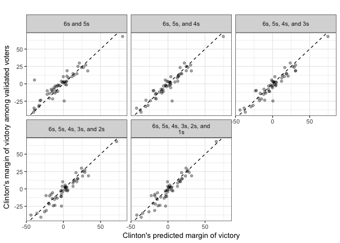

Analysis Part II - State Models
================
March 6, 2018

-   [Introduction](#introduction)
-   [Vote Intent](#vote-intent)
    -   [Individual-level turnout](#individual-level-turnout)
    -   [Election Predictions](#election-predictions)
-   [Vote Intent + Vote History](#vote-intent-vote-history)
    -   [Individual-level turnout](#individual-level-turnout-1)
    -   [Election Predictions](#election-predictions-1)
-   [Perry-Gallup Index](#perry-gallup-index)
    -   [Individual-level turnout](#individual-level-turnout-2)
    -   [Election Predictions](#election-predictions-2)
-   [Logistic Regression](#logistic-regression)
    -   [Individual-level turnout](#individual-level-turnout-3)

Introduction
============

This document will follow a similar format as `national_models` (view that [here](https://github.com/AnthonyRentsch/thesis_LikelyVoters/blob/master/national_models.md)). Again, the flow will be as follows:

-   Vote intent
-   Vote intent + vote history
-   Perry-Gallup index
-   Logistic regression
    -   Perry-Gallup
    -   Perry-Gallup + all variables potentially related to turnout
    -   Perry-Gallup + all variables potentially related to turnout + structural election variables
-   Random forests
    -   Perry-Gallup
    -   Perry-Gallup + all variables potentially related to turnout
    -   Perry-Gallup + all variables potentially related to turnout + structural election variables

In each section I will create a model and then evaluate how well it predicts voting behavior on an individual-level on a state-by-state basis. At the end, I will use these models to make election predictions for each state. The visualizations I make in this document will likely vary from those in `national_models` to account for the fact that I have to consider 51 instances of each model (one for each state and D.C.) and not just one national model.

Due to smaller sample sizes in some states in the 2016 CCES, I may choose to drop a handful of states or so from my analysis, which I will make clear if I choose to do so.

| state                |      n|
|:---------------------|------:|
| Alabama              |   3284|
| Alaska               |    538|
| Arizona              |   6671|
| Arkansas             |   2389|
| California           |  24928|
| Colorado             |   4532|
| Connecticut          |   3197|
| Delaware             |   1025|
| District of Columbia |    637|
| Florida              |  19453|
| Georgia              |   8158|
| Hawaii               |    827|
| Idaho                |   1449|
| Illinois             |  10633|
| Indiana              |   5460|
| Iowa                 |   2875|
| Kansas               |   2659|
| Kentucky             |   3672|
| Louisiana            |   3037|
| Maine                |   1619|
| Maryland             |   4756|
| Massachusetts        |   5314|
| Michigan             |   8561|
| Minnesota            |   4585|
| Mississippi          |   1858|
| Missouri             |   5675|
| Montana              |    965|
| Nebraska             |   1652|
| Nevada               |   2993|
| New Hampshire        |   1617|
| New Jersey           |   6985|
| New Mexico           |   1865|
| New York             |  14790|
| North Carolina       |   7707|
| North Dakota         |    582|
| Ohio                 |  10764|
| Oklahoma             |   2670|
| Oregon               |   4430|
| Pennsylvania         |  12886|
| Rhode Island         |    968|
| South Carolina       |   3632|
| South Dakota         |    745|
| Tennessee            |   4893|
| Texas                |  17574|
| Utah                 |   2215|
| Vermont              |    627|
| Virginia             |   6924|
| Washington           |   6344|
| West Virginia        |   1658|
| Wisconsin            |   5413|
| Wyoming              |    486|

Vote Intent
===========

Individual-level turnout
------------------------

Election Predictions
--------------------

Clinton's chances are overestimated by an average of 2.43 points, across all vote intent model types. Breaking it down by type:

| model                                                        |  mean\_error|       MSE|
|:-------------------------------------------------------------|------------:|---------:|
| Already voted + will definitely vote                         |     2.411961|  39.20252|
| Already voted + will definitely or probably vote             |     2.628627|  46.47919|
| Already voted + will definitely or probably vote + undecided |     2.392745|  39.87361|
| All respondents                                              |     2.288039|  49.19410|

Vote Intent + Vote History
==========================

This section will necessarily exclude all respondents who were not old enough to vote in the 2012 election (are 22 years old or younger now).

Individual-level turnout
------------------------

Election Predictions
--------------------

Looks like this overestimates Clinton's chances a bit. The average difference between a state's predicted margin and margin among validated voters is a little over 2.5 points in favor of Clinton, across all model types. Looking at specific model types:

| model                                                        |  mean\_error|       MSE|
|:-------------------------------------------------------------|------------:|---------:|
| Already voted + will definitely vote                         |     2.491078|  43.18726|
| Already voted + will definitely or probably vote             |     2.634608|  46.69294|
| Already voted + will definitely or probably vote + undecided |     2.563137|  42.54534|
| All respondents                                              |     2.560196|  47.25696|

Perry-Gallup Index
==================

Not many states have a large number of people with a Perry-Gallup index of 6, so I'll combine the 5s and 6s for each state.

Individual-level turnout
------------------------

Election Predictions
--------------------

| model                  |  mean\_error|       MSE|
|:-----------------------|------------:|---------:|
| 6s and 5s              |    -2.349608|  84.97869|
| 6s, 5s, and 4s         |     1.449804|  44.02442|
| 6s, 5s, 4s, and 3s     |     2.405490|  48.38613|
| 6s, 5s, 4s, 3s, and 2s |     2.397255|  50.76708|
| All                    |     2.282157|  48.79396|

Logistic Regression
===================

Individual-level turnout
------------------------
