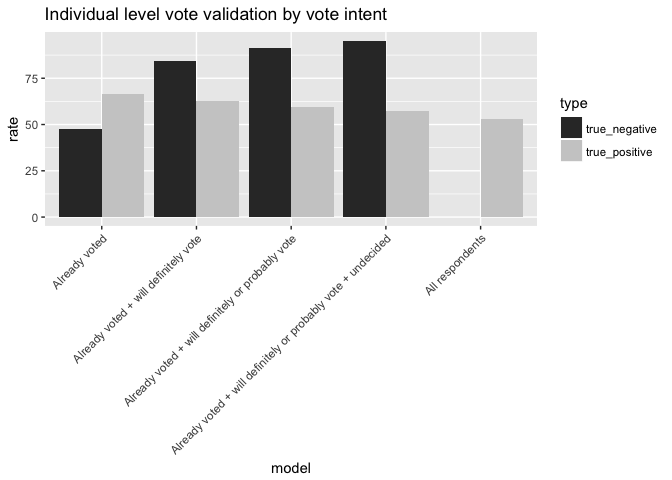

Cutoff Models
================
February 5, 2018

-   [Introduction](#introduction)
-   [Vote Intent](#vote-intent)
    -   [Individual-level turnout](#individual-level-turnout)
    -   [Election predictions](#election-predictions)
-   [Vote Intent + Vote History](#vote-intent-vote-history)
    -   [Individual-level turnout](#individual-level-turnout-1)
    -   [Election predictions](#election-predictions-1)
-   [Perry-Gallup index](#perry-gallup-index)
    -   [Individual-level turnout](#individual-level-turnout-2)
    -   [Election predictions](#election-predictions-2)
-   [Logistic regression](#logistic-regression)
    -   [Perry-Gallup index](#perry-gallup-index-1)
    -   [Perry-Gallup + all variables potentially related to turnout](#perry-gallup-all-variables-potentially-related-to-turnout)
-   [Random Forests](#random-forests)
    -   [Perry- Gallup index](#perry--gallup-index)
    -   [Perry-Gallup index + all variables potentially related to turnout](#perry-gallup-index-all-variables-potentially-related-to-turnout)

Introduction
============

In this document, I will define and create the cutoff models that I will use for my analysis and then evaluate their performance. The sections will proceed as follows:

-   Vote intent
-   Vote intent + vote history
-   Perry-Gallup index
-   Logistic regression
    -   Perry-Gallup
    -   Perry-Gallup + all variables potentially related to turnout
    -   Perry-Gallup + all variables potentially related to turnout + structural election variables
-   Random forests
    -   Perry-Gallup
    -   Perry-Gallup + all variables potentially related to turnout
    -   Perry-Gallup + all variables potentially related to turnout + structural election variables

In each section I will create a model and then evaluate how well it predicts voting behavior on an individual-level. At the end, I will use these models to make election predictions.

Vote Intent
===========

For now, I am doing this for 2016 until I can create the pooled data set. Here I treat people who report that they have already voted the same as people who report that they definitely plan to vote. Note that the weight I use -- `commonweight` from the `cces16` data -- combines weights based on age, gender, education, race, voter registration, ideology, baseline party identification, born again status, and political interest.

``` r
# grab data and filter only those with valid vote intent responses
data <- cces16 %>% select(V101, state_abbreviation, CC16_364, CC16_364b, CC16_364c,  
                          CL_E2016GVM, commonweight) %>% 
  rename(ID = V101, state = state_abbreviation, intent = CC16_364, earlychoice = CC16_364b, 
         choice = CC16_364c, validated = CL_E2016GVM, weight = commonweight) %>% 
  filter(intent %in% c(1,2,3,4,5))

# merge vote choice for early/absentee voters and prospective voters
data <- data %>% 
  mutate(choice = replace(choice, earlychoice == 1, 1)) %>% 
  mutate(choice = replace(choice, earlychoice == 2, 2))
```

Individual-level turnout
------------------------

``` r
validation_by_intent <- function(intention){
  willvote <- data %>% 
    filter(intent %in% intention)
  wontvote <- data %>% 
    anti_join(willvote, by = "ID")

  pred_voters <- willvote %>% 
    count(validated = !is.na(validated)) %>% 
    mutate(percent = round((n/sum(n))*100,2)) %>% 
    mutate(validated = replace(validated, validated == "FALSE", "No")) %>% 
    mutate(validated = replace(validated, validated == "TRUE", "Yes")) %>% 
    select(-n)
  
  pred_nonvoters <- wontvote %>% 
    count(validated = !is.na(validated)) %>% 
    mutate(percent = round((n/sum(n))*100,2)) %>% 
    mutate(validated = replace(validated, validated == "FALSE", "No")) %>% 
    mutate(validated = replace(validated, validated == "TRUE", "Yes")) %>% 
    select(-n)
  
  left_join(pred_voters, pred_nonvoters, by = "validated", suffix = c("_v","_nv")) %>% 
    rename(voters = percent_v, nonvoters = percent_nv)
}
```

First we compare individual-level turnout prediction accuracy when we define likely voters as:

-   those who say they already voted
-   those who say they will definitely vote or have voted already
-   those who say they will definitely vote, have voted already, or will probably vote
-   those who say they will definitely vote, have voted already, will probably vote, or who are undecided
-   all respondents in the sample

Let's sum that all up, where

-   true positive rate = rate at which predicted voters are validated as voters
-   true negative rate = rate at which predicted nonvoters are not validated as voters



Election predictions
--------------------

``` r
vote_choice_intent <- function(intention){
  data %>% 
  filter(intent %in% intention) %>% 
  filter(choice %in% c(1,2) | earlychoice %in% c(1,2)) %>% 
  mutate(choice = replace(choice, choice == 1, "Trump")) %>% 
  mutate(choice = replace(choice, choice == 2, "Clinton")) %>% 
  group_by(choice) %>% 
  summarise(n = sum(weight)) %>% 
  mutate(vote_share = round(n/sum(n)*100,2)) %>% 
  select(-n)
}
```

Now we compare election predictions, using the same likely voter models as specified above.


Vote Intent + Vote History
==========================

Let's move on to the next baseline model - using vote history and vote intent. I follow the same template from above but consider what happens when likely voters are defined as individuals who report that they voted in the previous presidential election (2012) as well as what happens when we do not make that distinction.

Individual-level turnout
------------------------

First, I'll consider everyone who self-reported that they voted in 2012. Note that this will necessarily exclude any respondent who was too young to vote in 2012 (unless they lie on this question, of course).


Might be useful to make a table with this, as this is a lot to take in visually.

Election predictions
--------------------


My takeaway is that adding vote history does not add much information on top of vote intent. But this is just for 2016 election predictions - may be useful to predict individual-level turnout and may be useful for other elections still.

Perry-Gallup index
==================

In their 2016 report on likely voter methodology, the Pew Research Center uses the Perry-Gallup index to measure likelyhood to vote. The questions they use, as well as the response options, are listed below. Response options that are bolded give a respondent a point in the index.

-   How much thought have you given to the coming November election? **Quite a lot**, **some**, only a little, none.
-   Have you ever voted in your precinct or election district? **Yes**, no.
-   Would you say you follow what’s going on in government and public affairs **most of the time**, **some of the time**, only now and then, hardly at all?
-   How often would you say you vote? **Always**, **nearly always**, part of the time, seldom.
-   How likely are you to vote in the general election this November? **Definitely will vote**, **probably will vote**, probably will not vote, definitely will not vote.
-   In the 2012 presidential election between Barack Obama and Mitt Romney, did things come up that kept you from voting, or did you happen to vote? **Yes, voted**; no.
-   Please rate your chance of voting in November on a scale of 10 to 1. 0-8, **9**, **10**.

Since the common content of the CCES does not include all of these survey items (and question wording varies when they do appear), I will attempt to recreate the index using what is available to me.

The three variables I will consider are vote intent, vote history, and political interest, which capture 5 of the 7 items on the Perry-Gallup index. The one dimension that I will not be able to recreate is historical voting behavior (voted in precinct before, voting frequency), as this information is not available on the CCES. Here are the CCES questions I will use along with the response options, and how many points each response option gives an individual toward the index.

-   Do you intend to vote in 2016 general election?
    -   Yes, definitely (**+2**)
    -   Probably (**+1**)
    -   I already voted (early or absentee) (**+2**)
    -   No
    -   Undecided
-   In 2012, who did you vote for in the election for President?
    -   Barack Obama (**+1**)
    -   Mitt Romney (**+1**)
    -   Someone else (**+1**)
    -   Did not vote
    -   Don't recall
-   Some people seem to follow what is going on in government or public affairs most of the time, whether there's an election or not. Others aren't that interested. Would you say you follow what is going on in government and public affairs...
    -   Most of the time (**+2**)
    -   Some of the time (**+1**)
    -   Only now and then
    -   Hardly at all
    -   Don't know

There are two further adjustments I make. First, Pew samples off of a list of registered voters, which the CCES does not do. To compensate, respondents who report that they are registered to vote are given an additional point. Second, since respondents who are younger than 22 would not have had the chance to vote in the previous election, they are given one additional point.

The minimum score, corresponding to those least likely to vote, is 0 while the maximum score, corresponding to those most likely to vote, is 6.

``` r
data <- cces16 %>% select(V101, state_abbreviation, CC16_364b, CC16_364c,  
                          CL_E2016GVM, commonweight, CC16_326, CC16_364, newsint, birthyr, votereg) %>% 
  rename(ID = V101, state = state_abbreviation, earlychoice = CC16_364b, choice = CC16_364c, 
         validated = CL_E2016GVM, weight = commonweight, vote12 = CC16_326, intent = CC16_364, 
         interest = newsint, birthyr = birthyr, registration = votereg) %>% 
  mutate(age = 2016 - birthyr) %>% 
  select(-birthyr)

# merge vote choice for early/absentee voters and prospective voters
data <- data %>% 
  mutate(choice = replace(choice, earlychoice == 1, 1)) %>% 
  mutate(choice = replace(choice, earlychoice == 2, 2))

# calculate Perry-Gallup index
data <- data %>% mutate(perry_gallup = 0)

# vote intent
data$perry_gallup[data$intent == 1 | data$intent == 3] <- data$perry_gallup + 2
data$perry_gallup[data$intent == 2]  <- data$perry_gallup + 1

# vote history
data$perry_gallup[data$vote12 == 1 | data$vote12 == 2 | data$vote12 == 3] <- data$perry_gallup + 1

# political interest
data$perry_gallup[!is.na(data$interest) && data$interest == 1] <- data$perry_gallup + 2
data$perry_gallup[!is.na(data$interest) && data$interest == 2] <- data$perry_gallup + 1

# voter registration 
data$perry_gallup[data$registration == 1] <- data$perry_gallup + 1

# age adjustment
data$perry_gallup[data$age < 22 && (data$vote12 == 4 | data$vote12 == 5 | 
                                      data$vote12 == 8 | data$vote12 == 9)] <- data$perry_gallup + 1
```

Individual-level turnout
------------------------


Election predictions
--------------------


Logistic regression
===================

Now I'll move onto building a logistic regression model to measure an individual's likelihood of voting. I'll do this using two sets of variables:

-   Perry-Gallup index
-   Perry-Gallup index + all variables potentially related to turnout

I will also be considering a model that includes variables typically included in structural election forecasting models, but while I am just using the 2016 data I cannot do this. Note that I made an age adjustment in the previous section but I do not consider age when I run the model that strictly considers questions that form the Perry-Gallup index.

Perry-Gallup index
------------------

### Building model

``` r
# split data into training and test sets
set.seed(16)
train <- data %>% sample_frac(0.7)
test <- data %>% anti_join(train, by = "ID")

# exclude Rs who weren't asked these questions in train...
train <- train[train$vote12 < 8,] 
train <- train[train$intent < 8,]
train <- train[train$interest < 8,]

# ... and test
test <- test[test$vote12 < 8,] 
test <- test[test$intent < 8,]
test <- test[test$interest < 8,]

# recode vote12 so that we capture whether someone voted or not and not for who for train...
train$vote12[train$vote12 == 1 | train$vote12 == 2 | train$vote12 == 3] <- 1
train$vote12[train$vote12 == 4 | train$vote12 == 5] <- 2

# ... and test
test$vote12[test$vote12 == 1 | test$vote12 == 2 | test$vote12 == 3] <- 1
test$vote12[test$vote12 == 4 | test$vote12 == 5] <- 2

# recode interest to put 'Don't know' responses as 'Hardly at all'
train$interest[train$interest == 7] <- 4
test$interest[test$interest == 7] <- 4

# set all categorical variables as factors
train <- train %>% mutate(validated = as.factor(validated),
                 vote12 = as.factor(vote12),
                 intent = as.factor(intent),
                 interest = as.factor(interest),
                 registration = as.factor(registration))
test <- test %>% mutate(validated = as.factor(validated),
                 vote12 = as.factor(vote12),
                 intent = as.factor(intent),
                 interest = as.factor(interest),
                 registration = as.factor(registration))

# run model
svy.train <- svydesign(ids = ~ 1, data = train, weights = ~weight)
formula <- as.formula(validated ~ vote12 + intent + interest + registration)
model <- svyglm(formula, design = svy.train, family = binomial)

# apply the model to test data
predictions <- cbind(test, predict(model, newdata = test, type = "response"))
predictions <- as.data.frame(predictions)
```

### Individual-level turnout


As we consider a larger turnout rate, our true negative rate (rate that nonvoters get predicted to be nonvoters) goes up while our true positive rate (rate at which voters get predicted to be voters) goes down. This makes sense.

What's trickier is figuring out where to strike the right balance between the two rates. To do this, we also need to look at the election predictions that likely voter models using different turnout rates produce.

Note that we use weights in two places - to construct a weighted logistic regression model to estimate vote propensity (using the `survey` package) and again to calculate a weighted vote share estimate.

### Election predictions


This does not fit with what I would have believed before - I would have guessed, based on the findings of the other models, that more likely voters would have voted overwhelmingly for Clinton, i.e. a lower turnout of just extremely likely voters would vote in favor of Clinton.

This suggests that using a likely voter model with a turnout rate between 2% and 57% would have *nearly* perfectly predicted the final margin.

Perry-Gallup + all variables potentially related to turnout
-----------------------------------------------------------

I will essentially repeat the process from above, but now the logistic regression model will consider *11* demographic variables that literature on voter turnout has suggested are correlated to turnout. Those variables are:

-   Gender
-   Age
-   Race
-   Education
-   Family income
-   Partisan/ideological strength
-   Religiosity
-   ~~Racial composition of district~~ **Not available on CCES**
-   Marital status
-   Residential mobility
-   Political interest/activism
    -   Watch news
    -   Read paper

Note that this list should not be viewed as comprehensive - it reflects the research that I conducted for this project and it is possible that I have missed potentially important variables. Furthermore, note that the inclusion of the political interest/activism items about watching the news or reading the paper reduces the training sample by nearly 20k respondents (33,222 to 13,474) and the test sample by roughly 9k respondents (14,464 to 5,687).

### Building model

``` r
# run model
formula <- as.formula(validated ~ vote12 + intent + interest + registration + gender + age + race + 
                        education + income_new + partisan_strength + religiosity + marital_status +
                        residential_mobility + watch_news + read_paper)

svy.train <- svydesign(ids = ~ 1, data = train, weights = ~weight)
model <- svyglm(formula, design = svy.train, family = binomial)

# apply the model to test data
predictions <- cbind(test, predict(model, newdata = test, type = "response"))
predictions <- as.data.frame(predictions)
```

### Coefficients of model

| term                  |  estimate|  std.error|  statistic|  p.value|
|:----------------------|---------:|----------:|----------:|--------:|
| (Intercept)           |    -1.566|      0.415|     -3.769|    0.000|
| vote122               |     0.061|      0.325|      0.187|    0.852|
| intent2               |    -0.501|      0.177|     -2.825|    0.005|
| intent3               |     0.096|      0.175|      0.548|    0.584|
| intent4               |    -1.987|      0.777|     -2.558|    0.011|
| intent5               |    -1.167|      0.327|     -3.567|    0.000|
| interest2             |    -0.284|      0.068|     -4.179|    0.000|
| interest3             |    -0.251|      0.134|     -1.874|    0.061|
| interest4             |    -0.557|      0.222|     -2.513|    0.012|
| registration2         |    -2.453|      0.597|     -4.108|    0.000|
| registration3         |    -1.840|      0.879|     -2.093|    0.036|
| gender2               |     0.145|      0.059|      2.433|    0.015|
| age                   |     0.038|      0.002|     17.640|    0.000|
| raceBlack             |     0.497|      0.174|      2.857|    0.004|
| raceHispanic          |     0.198|      0.189|      1.046|    0.296|
| raceMiddle Eastern    |     0.489|      0.647|      0.756|    0.449|
| raceMixed             |     0.375|      0.276|      1.359|    0.174|
| raceNative American   |    -0.037|      0.367|     -0.102|    0.919|
| raceOther             |     0.416|      0.275|      1.515|    0.130|
| raceWhite             |     0.558|      0.149|      3.736|    0.000|
| education2            |    -0.383|      0.335|     -1.145|    0.252|
| education3            |    -0.164|      0.336|     -0.487|    0.626|
| education4            |    -0.232|      0.342|     -0.679|    0.497|
| education5            |    -0.394|      0.339|     -1.162|    0.245|
| education6            |    -0.365|      0.341|     -1.070|    0.285|
| income\_new2          |    -0.174|      0.085|     -2.046|    0.041|
| income\_new3          |    -0.084|      0.096|     -0.875|    0.381|
| income\_new4          |    -0.264|      0.121|     -2.176|    0.030|
| partisan\_strength2   |     0.018|      0.072|      0.255|    0.799|
| partisan\_strength3   |    -0.011|      0.078|     -0.146|    0.884|
| partisan\_strength4   |    -0.325|      0.095|     -3.417|    0.001|
| religiosity2          |    -0.092|      0.122|     -0.754|    0.451|
| religiosity3          |     0.056|      0.138|      0.402|    0.688|
| religiosity4          |     0.211|      0.131|      1.609|    0.108|
| religiosity5          |     0.094|      0.124|      0.758|    0.448|
| religiosity6          |     0.235|      0.121|      1.944|    0.052|
| religiosity7          |     0.082|      0.377|      0.217|    0.829|
| marital\_status2      |     0.206|      0.084|      2.449|    0.014|
| marital\_status3      |    -0.118|      0.084|     -1.409|    0.159|
| residential\_mobility |     0.001|      0.008|      0.146|    0.884|
| watch\_news2          |     0.007|      0.091|      0.076|    0.940|
| watch\_news3          |    -0.011|      0.072|     -0.148|    0.882|
| read\_paper2          |     0.244|      0.071|      3.423|    0.001|
| read\_paper3          |    -0.168|      0.075|     -2.255|    0.024|

### Individual-level turnout


### Election predictions

Recall again that weights are used in two places - to construct the model and again to calculate estimates.


Using this model, most accurate prediction would have been given using a **really** low turnout rate - 5%. This is also concerning because it suggests adding more information makes this predictions considerably worse.

One thing to think about is that here I am training a model on information that a pollster would not have at the time of polling. In order to make this more realistic I would need to train this on prior voting history, not the validated vote for the election that hasn't happened yet.

One last time: recall that in both logistic regression models I consider I use the weights twice - I run a weighted logistic regression and then I calculate the weighted sums of the number of respondents who say they will vote for each candidate to calculate the vote shares. Doing this did not change the results considerably from using the weights once (either to just run a weighted regression or to calculate the weighted vote shares).

Random Forests
==============

For random forests, I'll employ a similar approach as I did for logistic regression - building a classification random forest model to measure an individual's likelihood of voting. I'll do this using two sets of variables:

-   Perry-Gallup index
-   Perry-Gallup index + all variables potentially related to turnout

I will also be considering a model that includes variables typically included in structural election forecasting models, but while I am just using the 2016 data I cannot do this. Note that I made an age adjustment in the previous section but I do not consider age when I run the model that strictly considers questions that form the Perry-Gallup index.

Perry- Gallup index
-------------------

### Individual-level turnout


This model performs incredibly poorly, perhaps because the inclusion of so few variables in the random forest algorithm does not allow the model to differentiate the vote likelihood of respondents very well. In fact, this model predicts that almost all respondents are likely voters, which can't be right. The next model, which considers more variables, performs quite a bit better.

Perry-Gallup index + all variables potentially related to turnout
-----------------------------------------------------------------

### Individual-level turnout


### Election predictions


This is more of the distribution of vote propensity scores that I would expect to see. Similarly, this is the trend in the true negative and true positive rates that I would expect to see. When we turn to election predictions, this model actually gets really close to predicting the correct result if we consider a very low turnout rate (a little under 25%).
