Analysis Part II - State Models
================
July 21, 2018

-   [Introduction](#introduction)
-   [Vote Intent](#vote-intent)
    -   [Individual-level turnout](#individual-level-turnout)
    -   [Election Predictions](#election-predictions)
-   [Vote Intent + Vote History](#vote-intent-vote-history)
    -   [Individual-level turnout](#individual-level-turnout-1)
    -   [Election Predictions](#election-predictions-1)
-   [Perry-Gallup Index](#perry-gallup-index)
    -   [Individual-level turnout](#individual-level-turnout-2)
    -   [Election Predictions](#election-predictions-2)
-   [Logistic Regression](#logistic-regression)
    -   [Perry-Gallup index](#perry-gallup-index-1)
    -   [Perry-Gallup index + all variables potentially related to turnout](#perry-gallup-index-all-variables-potentially-related-to-turnout)
    -   [Perry-Gallup index + demographics+ structural election variables](#perry-gallup-index-demographics-structural-election-variables)
-   [Random Forests](#random-forests)
    -   [Perry-Gallup index](#perry-gallup-index-2)
    -   [Perry-Gallup index + all variables potentially related to turnout](#perry-gallup-index-all-variables-potentially-related-to-turnout-1)
    -   [Perry-Gallup index + demographics+ structural election variables](#perry-gallup-index-demographics-structural-election-variables-1)

Introduction
============

This document will follow a similar format as `national_models` (view that [here](https://github.com/AnthonyRentsch/thesis_LikelyVoters/blob/master/national_models.md)). Again, the flow will be as follows:

-   Vote intent
-   Vote intent + vote history
-   Perry-Gallup index
-   Logistic regression
    -   Perry-Gallup
    -   Perry-Gallup + demographics
    -   Perry-Gallup + demographics+ structural election variables
-   Random forests
    -   Perry-Gallup
    -   Perry-Gallup + demographics
    -   Perry-Gallup + demographics+ structural election variables

In each section I will create a model and then evaluate how well it predicts voting behavior on an individual-level on a state-by-state basis. At the end, I will use these models to make election predictions for each state. The visualizations I make in this document will likely vary from those in `national_models` to account for the fact that I have to consider 51 instances of each model (one for each state and D.C.) and not just one national model.

Due to smaller sample sizes in some states in the 2016 CCES, I may choose to drop a handful of states or so from my analysis, which I will make clear if I choose to do so.

| state                |      n|
|:---------------------|------:|
| Alabama              |   3284|
| Alaska               |    538|
| Arizona              |   6671|
| Arkansas             |   2389|
| California           |  24928|
| Colorado             |   4532|
| Connecticut          |   3197|
| Delaware             |   1025|
| District of Columbia |    637|
| Florida              |  19453|
| Georgia              |   8158|
| Hawaii               |    827|
| Idaho                |   1449|
| Illinois             |  10633|
| Indiana              |   5593|
| Iowa                 |   2875|
| Kansas               |   2659|
| Kentucky             |   3672|
| Louisiana            |   3037|
| Maine                |   1619|
| Maryland             |   4756|
| Massachusetts        |   5314|
| Michigan             |   8561|
| Minnesota            |   4585|
| Mississippi          |   1858|
| Missouri             |   5675|
| Montana              |    965|
| Nebraska             |   1652|
| Nevada               |   2993|
| New Hampshire        |   1617|
| New Jersey           |   7135|
| New Mexico           |   1865|
| New York             |  14938|
| North Carolina       |   7836|
| North Dakota         |    582|
| Ohio                 |  10764|
| Oklahoma             |   2670|
| Oregon               |   4430|
| Pennsylvania         |  12886|
| Rhode Island         |    968|
| South Carolina       |   3632|
| South Dakota         |    745|
| Tennessee            |   4893|
| Texas                |  17633|
| Utah                 |   2215|
| Vermont              |    627|
| Virginia             |   7068|
| Washington           |   6344|
| West Virginia        |   1658|
| Wisconsin            |   5413|
| Wyoming              |    486|

Vote Intent
===========

Individual-level turnout
------------------------

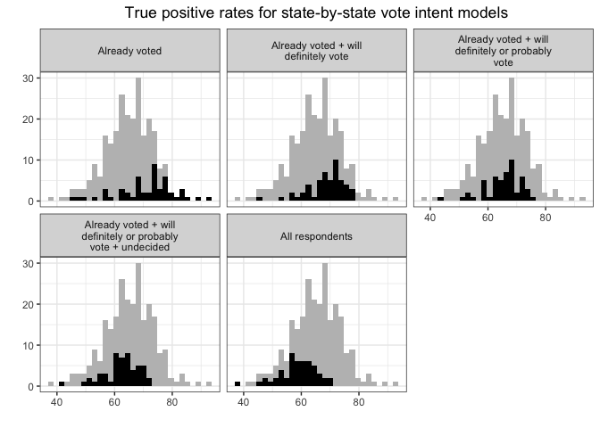

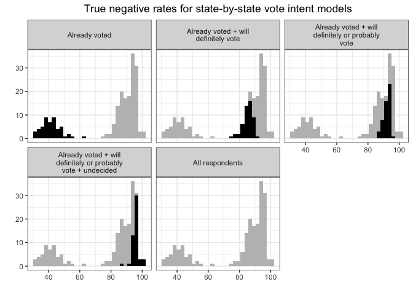

Election Predictions
--------------------

Clinton's chances are overestimated by an average of 2.43 points, across all vote intent model types. Breaking it down by type:

| model                                                        |  mean\_error|       MSE|
|:-------------------------------------------------------------|------------:|---------:|
| Already voted + will definitely vote                         |     2.459608|  35.76928|
| Already voted + will definitely or probably vote             |     2.676274|  45.64579|
| Already voted + will definitely or probably vote + undecided |     2.440392|  43.04591|
| All respondents                                              |     2.335686|  53.31500|

Vote Intent + Vote History
==========================

This section will necessarily exclude all respondents who were not old enough to vote in the 2012 election (are 22 years old or younger now).

Individual-level turnout
------------------------

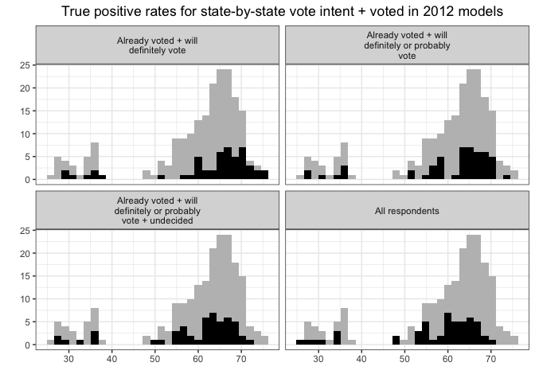

Election Predictions
--------------------

Looks like this overestimates Clinton's chances a bit. The average difference between a state's predicted margin and margin among validated voters is a little over 2.5 points in favor of Clinton, across all model types. Looking at specific model types:

| model                                                        |  mean\_error|       MSE|
|:-------------------------------------------------------------|------------:|---------:|
| Already voted + will definitely vote                         |     2.860490|  37.52696|
| Already voted + will definitely or probably vote             |     3.024118|  45.10705|
| Already voted + will definitely or probably vote + undecided |     3.125196|  45.09828|
| All respondents                                              |     3.193235|  51.65475|

Perry-Gallup Index
==================

Not many states have a large number of people with a Perry-Gallup index of 6, so I'll combine the 5s and 6s for each state.

Individual-level turnout
------------------------

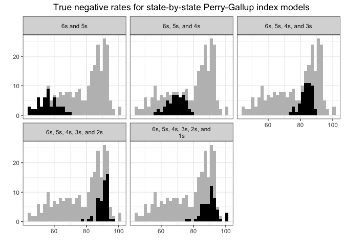

Election Predictions
--------------------

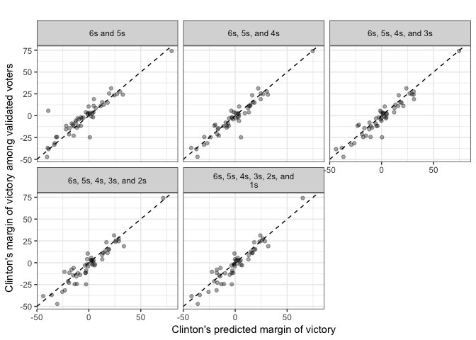

| model                      |  mean\_error|       MSE|
|:---------------------------|------------:|---------:|
| 6s and 5s                  |    -2.301961|  80.68354|
| 6s, 5s, and 4s             |     1.497451|  42.58601|
| 6s, 5s, 4s, and 3s         |     2.453137|  47.43655|
| 6s, 5s, 4s, 3s, and 2s     |     2.444902|  53.54221|
| 6s, 5s, 4s, 3s, 2s, and 1s |     2.329804|  52.72769|

Logistic Regression
===================

Perry-Gallup index
------------------

### Individual-level turnout

I'll first visualize the distribution of vote propensity scores for 9 random states using this model.

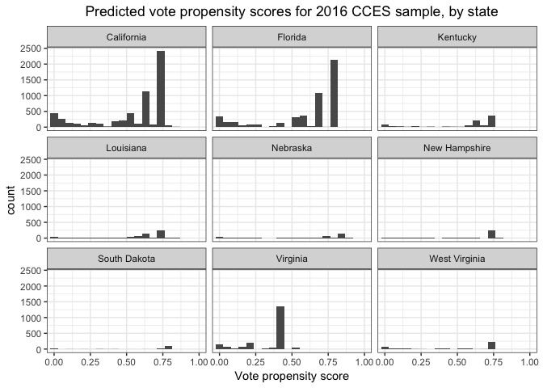

### Election Predictions

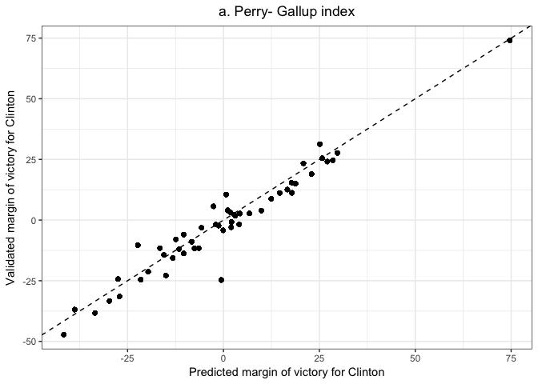

Perry-Gallup index + all variables potentially related to turnout
-----------------------------------------------------------------

This next model considers the Perry-Gallup index variables mentioned in the previous section in addition to a whole slew of demographic variables that literature has suggested may be tied to turnout or to misreporting voting intention. These include:

-   Age
-   Race
-   Education
-   Income
-   Partisan strength
-   Religiosity
-   Marital status
-   Residential mobility
-   ~~Racial composition of district~~
-   ~~Political interest/activism~~
    -   ~~Watching news~~
    -   ~~Reading newspaper~~

The racial composition of district and political interest/activism items are not included in my model because they are not widely available on the CCES surveys I consider. Again, models are trained on data from each state and then used to predict the election result in that state.

### Individual-level turnout

I'll first visualize the distribution of vote propensity scores for 9 random states using this model.

### Election Predictions

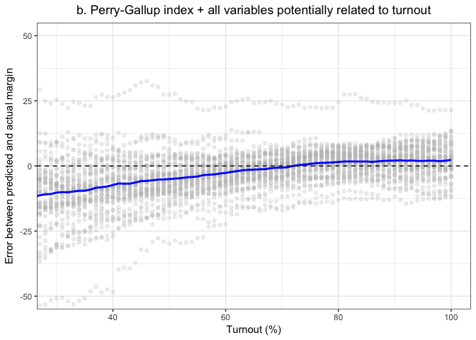

Perry-Gallup index + demographics+ structural election variables
----------------------------------------------------------------

In addtion to the variables I included in the last mode, I now include structural election variables. I use a reformulation of Abramowitz's Time-for-Change model. The model predicts the vote share for the candidate of the incumbent's party based on

-   the net approval rating of the sitting President (using the final Gallup poll in June of the election year)
-   the annualized growth rate of real GDP in the second quarter of the election year (taken from the U.S. Department of Commerce's Bureau of Economic Analysis)
-   whether a first-term incumbent is running
    -   Since I also use midterm election years, I consider whether the incumbent and the President are from the same party (this is coded 1 in presidential election years and 1 or 0 in midterm years)
-   an indicator variable to measure the level of polarization (this was added in 2012): it is coded
    -   1 if first-term incumbent running or open seat where incumbent president has net approval rating over 0 (presidential election years) or 1 if the House incumbent is from the same party as the President or if they are from different parties and the President has a net approval rating over 0 (midterm election years)
    -   0 if no first-term incumbent or incumbent president has net approval rating less than 0 (presidential election years) or 0 if the House incumbent and President are from different parties and the presidential net approval rating is less than 0 (midterm election years)

You can read more about his model [here](https://www.washingtonpost.com/blogs/ezra-klein/files/2012/08/abramowitz.pdf). Models are trained on data from each state and then used to predict the election result in that state.

### Individual-level turnout

I'll first visualize the distribution of vote propensity scores for 9 random states using this model.

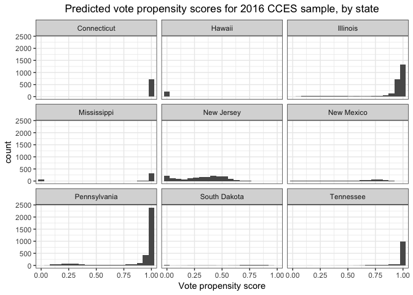

### Election Predictions

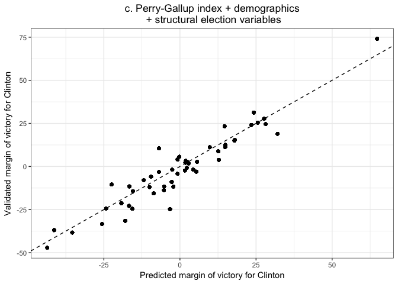

Random Forests
==============

Perry-Gallup index
------------------

I'll first visualize the distribution of vote propensity scores for 9 random states using this model.

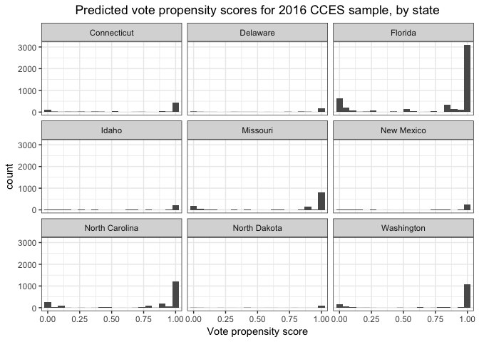

### Election Predictions

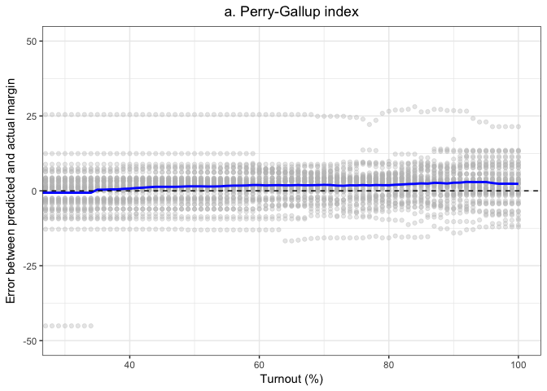

Perry-Gallup index + all variables potentially related to turnout
-----------------------------------------------------------------

I'll first visualize the distribution of vote propensity scores for 9 random states using this model.

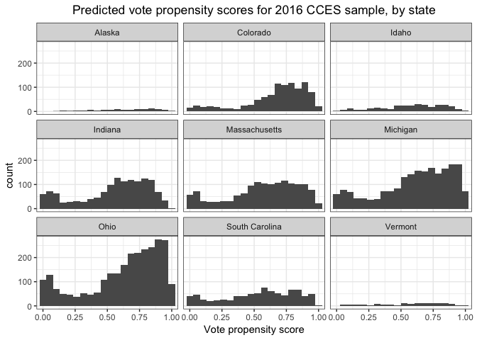

### Election Predictions

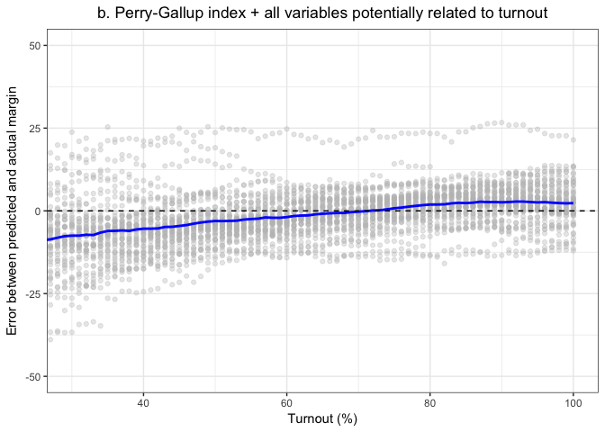

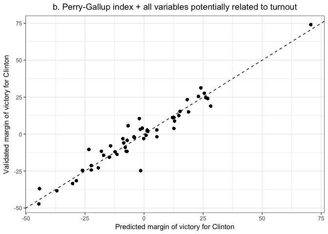

Perry-Gallup index + demographics+ structural election variables
----------------------------------------------------------------

I'll first visualize the distribution of vote propensity scores for 9 random states using this model.

### Election Predictions

